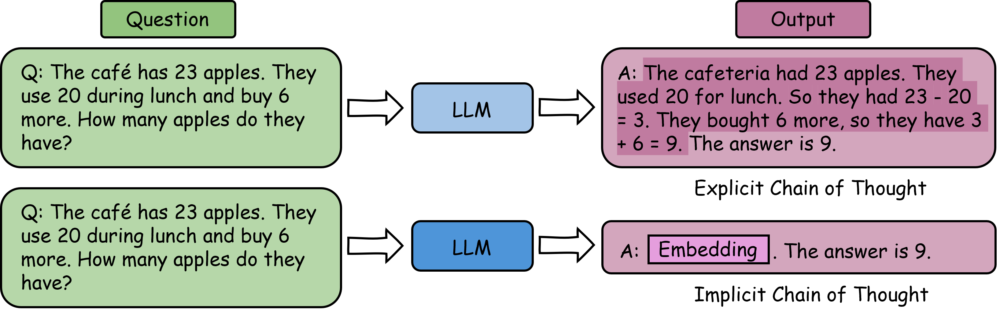

    

<h1 align="center">Awesome LLM Implicit Reasoning</h1>

    <b> A collection of papers that unlock the implicit reasoning ability of LLMs.</b>

### 2025

1. **[Efficient Reasoning with Hidden Thinking](https://arxiv.org/abs/2501.19201)**

    *Xuan Shen, Yizhou Wang, Xiangxi Shi, Yanzhi Wang, Pu Zhao, Jiuxiang Gu.* Preprint'25

2. **[Scaling up Test-Time Compute with Latent Reasoning: A Recurrent Depth Approach](https://arxiv.org/abs/2502.05171)**

    *Jonas Geiping, Sean McLeish, Neel Jain, John Kirchenbauer, Siddharth Singh, Brian R. Bartoldson, Bhavya Kailkhura, Abhinav Bhatele, Tom Goldstein.* Preprint'25

3. **[CODI: Compressing Chain-of-Thought into Continuous Space via Self-Distillation](https://arxiv.org/abs/2502.21074)**

    *Zhenyi Shen, Hanqi Yan, Linhai Zhang, Zhanghao Hu, Yali Du, Yulan He.* Preprint'25

4. **[SoftCoT: Soft Chain-of-Thought for Efficient Reasoning with LLMs](https://arxiv.org/abs/2502.12134)**

    *Yige Xu, Xu Guo, Zhiwei Zeng, Chunyan Miao.* Preprint'25

5. **[Scalable Language Models with Posterior Inference of Latent Thought Vectors](https://arxiv.org/abs/2502.01567)**

    *Deqian Kong, Minglu Zhao, Dehong Xu, Bo Pang, Shu Wang, Edouardo Honig, Zhangzhang Si, Chuan Li, Jianwen Xie, Sirui Xie, Ying Nian Wu.* Preprint'25

6. **[Reasoning with Latent Thoughts: On the Power of Looped Transformers](https://arxiv.org/abs/2502.17416)**

    *Nikunj Saunshi, Nishanth Dikkala, Zhiyuan Li, Sanjiv Kumar, Sashank J. Reddi.* ICLR'25

7. **[CoT-Valve: Length-Compressible Chain-of-Thought Tuning](https://arxiv.org/abs/2502.09601)**

    *Xinyin Ma, Guangnian Wan, Runpeng Yu, Gongfan Fang, Xinchao Wang.* Preprint'25

8. **[LightThinker: Thinking Step-by-Step Compression](https://arxiv.org/abs/2502.15589)**

    *Jintian Zhang, Yuqi Zhu, Mengshu Sun, Yujie Luo, Shuofei Qiao, Lun Du, Da Zheng, Huajun Chen, Ningyu Zhang.* Preprint'25

9. **[Beyond Words: A Latent Memory Approach to Internal Reasoning in LLMs](https://arxiv.org/abs/2502.21030v1)**

    *José I. Orlicki.* Preprint'25

### 2024

1. **[From Explicit CoT to Implicit CoT: Learning to Internalize CoT Step by Step](https://arxiv.org/abs/2405.14838)**

    *Yuntian Deng, Yejin Choi, Stuart Shieber.* Preprint'24

2. **[Training Large Language Models to Reason in a Continuous Latent Space](https://arxiv.org/abs/2412.06769)**

    *Shibo Hao, Sainbayar Sukhbaatar, DiJia Su, Xian Li, Zhiting Hu, Jason Weston, Yuandong Tian.* Preprint'24

3. **[Compressed Chain of Thought: Efficient Reasoning Through Dense Representations](https://arxiv.org/abs/2412.13171)**

    *Jeffrey Cheng, Benjamin Van Durme.* Preprint'24

### 2023

1. **[Implicit Chain of Thought Reasoning via Knowledge Distillation](https://arxiv.org/abs/2311.01460)**

    *Yuntian Deng, Kiran Prasad, Roland Fernandez, Paul Smolensky, Vishrav Chaudhary, Stuart Shieber.* Preprint'23